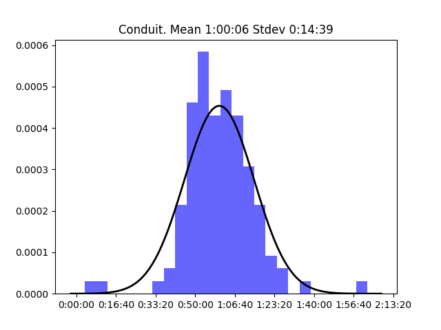
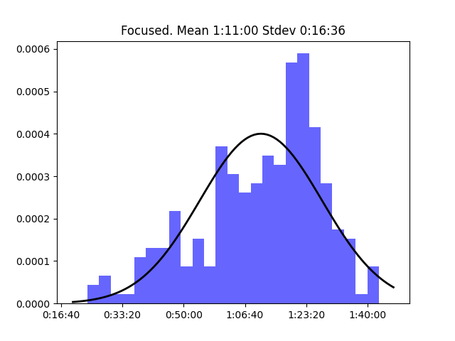
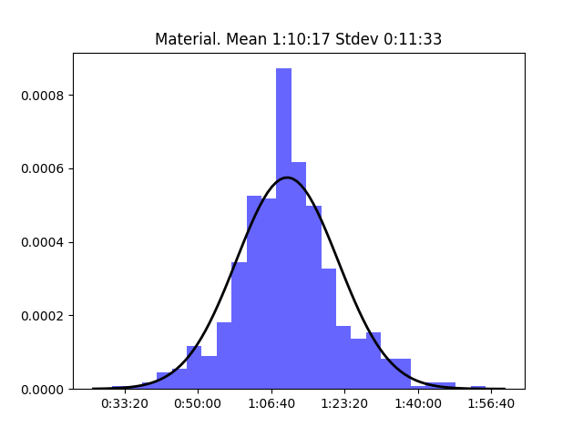
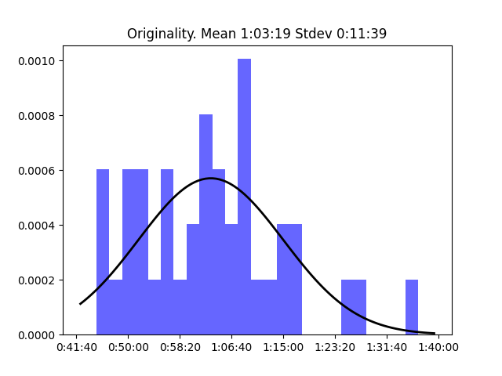
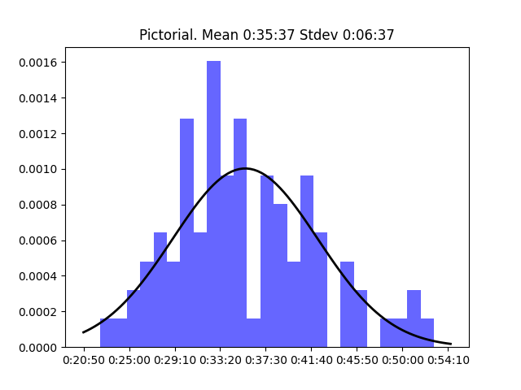
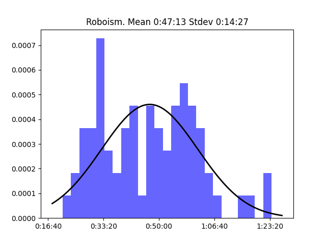
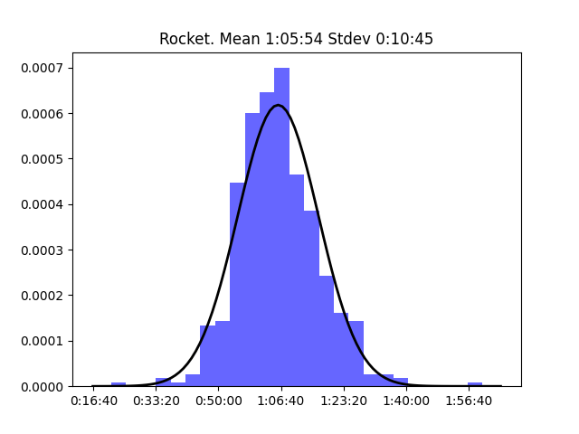

# Relay Shows

This shows the normal distribution for each show on the network

## Analog(ue)

**Longest episode:** Episode 194 (1:50:55)
**Shortest episode:** Episode 24 (0:39:48)

## Automators

**Longest episode:** Episode 74 (1:52:42)
**Shortest episode:** Episode 0 (0:03:24)

## BONANZA

**Longest episode:** Episode 5 (1:20:43)
**Shortest episode:** Episode 36 (0:40:54)

## Clockwise

**Longest episode:** Episode 68 (0:46:21)
**Shortest episode:** Episode 346 (0:22:51)

## Conduit

**Longest episode:** Episode 37 (1:36:48)
**Shortest episode:** Episode 0 (0:10:21)

## Connected

**Longest episode:** Episode 24 (2:56:24)
**Shortest episode:** Episode 90 (0:48:59)

## Cortex

**Longest episode:** Episode 135 (3:22:00)
**Shortest episode:** Episode 30 (1:07:24)

## Downstream

**Longest episode:** Episode 14 (1:23:03)
**Shortest episode:** Episode 34 (0:27:13)

## Focused

**Longest episode:** Episode 85 (1:43:04)
**Shortest episode:** Episode 11 (0:23:53)

## Liftoff

**Longest episode:** Episode 66 (1:20:25)
**Shortest episode:** Episode 94 (0:21:58)

## Mac Power Users

**Longest episode:** Episode 100 (2:26:39)
**Shortest episode:** Episode 2 (0:22:15)

## Make Do

**Longest episode:** Episode 4 (1:20:19)
**Shortest episode:** Episode 30 (0:24:37)

## Material

**Longest episode:** Episode 244 (1:48:32)
**Shortest episode:** Episode 26 (0:30:32)

## Originality

**Longest episode:** Episode 16 (1:36:42)
**Shortest episode:** Episode 24 (0:44:55)

## Parallel

**Longest episode:** Episode 41 (1:28:59)
**Shortest episode:** Episode 0 (0:06:48)

## Pictorial

**Longest episode:** Episode 34 (0:52:53)
**Shortest episode:** Episode 41 (0:22:21)

## Reconcilable Differences

**Longest episode:** Episode 25 (3:21:09)
**Shortest episode:** Episode 128 (1:04:46)

## Remaster

**Longest episode:** Episode 26 (1:30:48)
**Shortest episode:** Episode 7 (0:33:14)

## Roboism

**Longest episode:** Episode 36 (1:23:50)
**Shortest episode:** Episode 13 (0:21:04)

## Rocket

**Longest episode:** Episode 411 (1:39:55)
**Shortest episode:** Episode 315 (0:21:25)

## The Backmarkers

**Longest episode:** Episode 9 (1:12:14)
**Shortest episode:** Episode 8 (0:37:06)

## The Pen Addict

**Longest episode:** Episode 500 (3:00:29)
**Shortest episode:** Episode 33 (0:27:39)

## Thoroughly Considered

**Longest episode:** Episode 86 (1:13:37)
**Shortest episode:** Episode 1 (0:20:55)

## Top Four

**Longest episode:** Episode 34 (1:23:57)
**Shortest episode:** Episode 20 (0:00:58)

## Under the Radar

**Longest episode:** Episode 244 (0:44:34)
**Shortest episode:** Episode 177 (0:00:49)

## Ungeniused

**Longest episode:** Episode 1 (0:40:34)
**Shortest episode:** Episode 173 (0:00:12)

## Upgrade

**Longest episode:** Episode 332 (2:34:11)
**Shortest episode:** Episode 277 (0:34:16)

## 20 Macs for 2020

**Longest episode:** Episode 21 (1:44:09)
**Shortest episode:** Episode 0 (0:02:10)

## Adapt

**Longest episode:** Episode 29 (1:26:28)
**Shortest episode:** Episode 28 (0:47:00)

## Almanac

**Longest episode:** Episode 1 (1:29:48)
**Shortest episode:** Episode 1 (1:29:48)

## Bionic

**Longest episode:** Episode 56 (1:33:04)
**Shortest episode:** Episode 88 (0:38:56)

## Canvas

**Longest episode:** Episode 36 (1:16:30)
**Shortest episode:** Episode 39 (0:28:06)

## CMD Space

**Longest episode:** Episode 1 (1:41:27)
**Shortest episode:** Episode 74 (0:30:24)

## Disruption

**Longest episode:** Episode 28 (1:27:12)
**Shortest episode:** Episode 6 (0:43:15)

## Download

**Longest episode:** Episode 78 (1:15:06)
**Shortest episode:** Episode 108 (0:35:17)

## Flashback

**Longest episode:** Episode 4 (1:13:47)
**Shortest episode:** Episode 0 (0:02:10)

## Inquisitive

**Longest episode:** Episode 1 (1:32:58)
**Shortest episode:** Episode 33 (0:26:23)

## Isometric

**Longest episode:** Episode 26 (2:21:43)
**Shortest episode:** Episode 102 (0:01:10)

## Less Than or Equal

**Longest episode:** Episode 12 (1:41:12)
**Shortest episode:** Episode 7 (0:06:50)

## Mixed Feelings

**Longest episode:** Episode 34 (1:00:42)
**Shortest episode:** Episode 26 (0:35:53)

## Playing for Fun

**Longest episode:** Episode 7 (1:29:08)
**Shortest episode:** Episode 3 (0:32:37)

## Presentable

**Longest episode:** Episode 38 (1:08:03)
**Shortest episode:** Episode 123 (0:11:12)

## Query

**Longest episode:** Episode 46 (0:56:03)
**Shortest episode:** Episode 8 (0:19:02)

## Subnet

**Longest episode:** Episode 178 (0:04:15)
**Shortest episode:** Episode 0 (0:00:44)

## The Prompt

**Longest episode:** Episode 30 (2:35:19)
**Shortest episode:** Episode 16 (0:52:19)

## The Test Drivers

**Longest episode:** Episode 19 (1:33:52)
**Shortest episode:** Episode 0 (0:12:04)

## Virtual

**Longest episode:** Episode 9 (1:30:45)
**Shortest episode:** Episode 61 (0:01:36)

