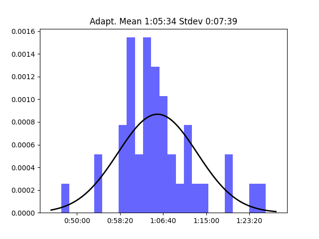
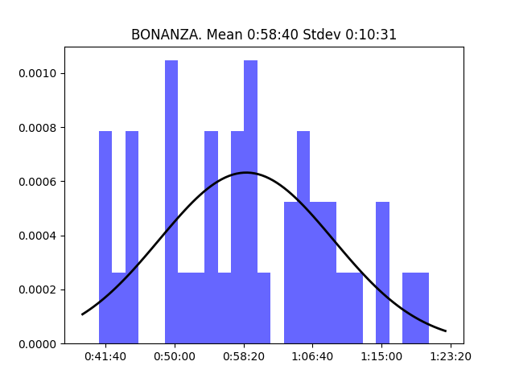
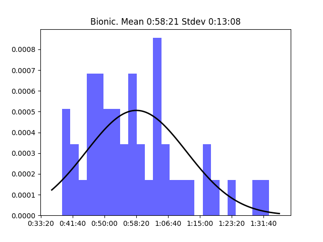
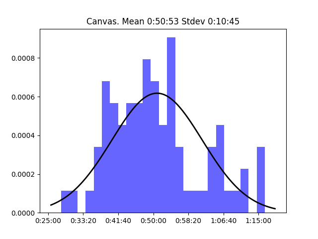
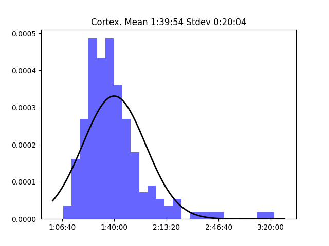
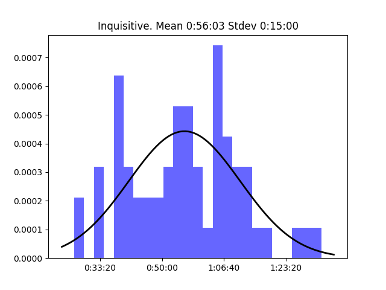
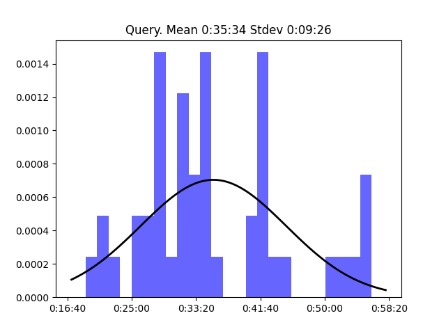
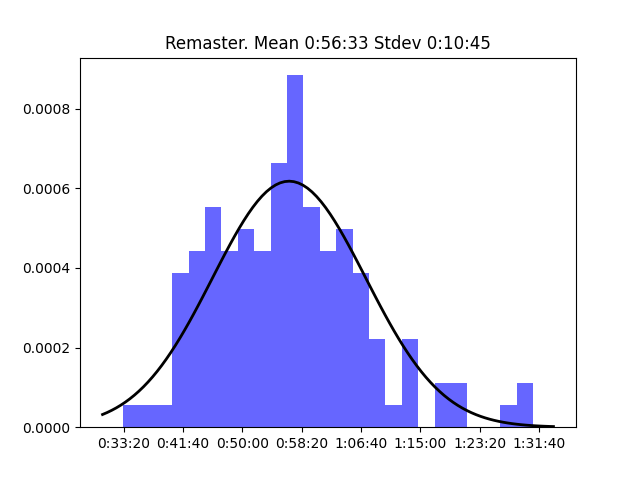
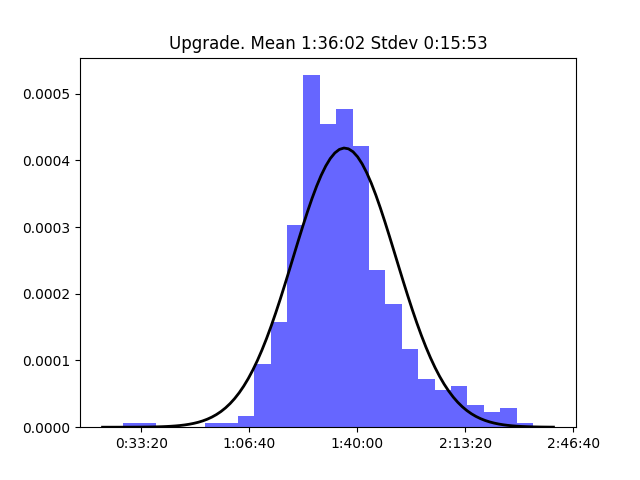
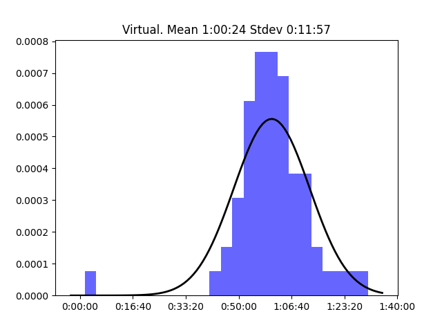

# Relay Shows

This shows the normal distribution for each show on the network

## 20 Macs for 2020

## Adapt

## Almanac

## Analog(ue)

.png>)

## Automators

## BONANZA

## Bionic

## CMD Space

## Canvas

## Clockwise

## Conduit

## Connected

## Cortex

## Disruption

## Download

## Downstream

## Flashback

## Focused

## Inquisitive

## Isometric

## Less Than or Equal

## Liftoff

## Mac Power Users

## Make Do

## Material

## Mixed Feelings

## Originality

## Parallel

## Pictorial

## Playing for Fun

## Presentable

## Query

## Reconcilable Differences

## Remaster

## Roboism

## Rocket

## Subnet

## The Backmarkers

## The Pen Addict

## The Prompt

## The Test Drivers

## Thoroughly Considered

## Top Four

## Under the Radar

## Ungeniused

## Upgrade

## Virtual

