# Relay Shows

This shows the normal distribution for each show on the network

## 20 Macs for 2020

## Adapt

## Almanac

## Analog(ue)

.png>)

## Automators

## BONANZA

## Bionic

## CMD Space

## Canvas

## Clockwise

## Conduit

## Connected

## Cortex

## Disruption

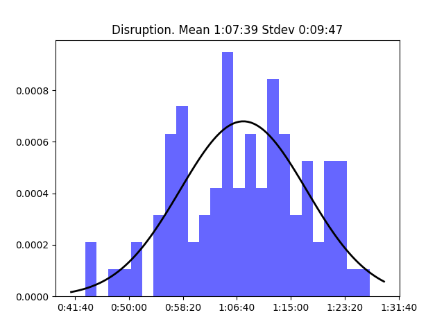

## Download

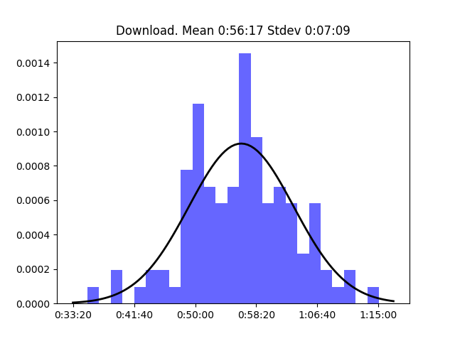

## Downstream

## Flashback

## Focused

## Inquisitive

## Isometric

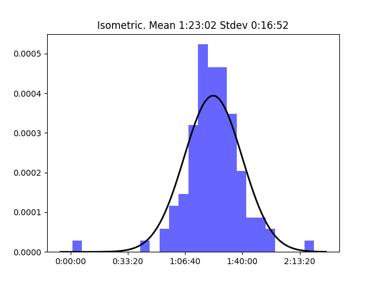

## Less Than or Equal

## Liftoff

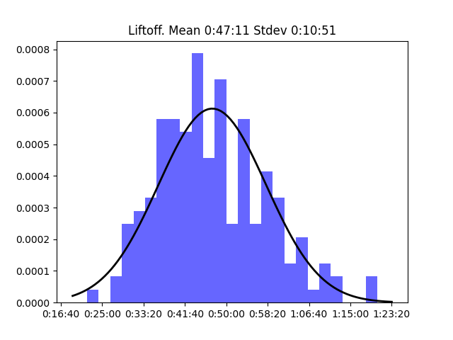

## Mac Power Users

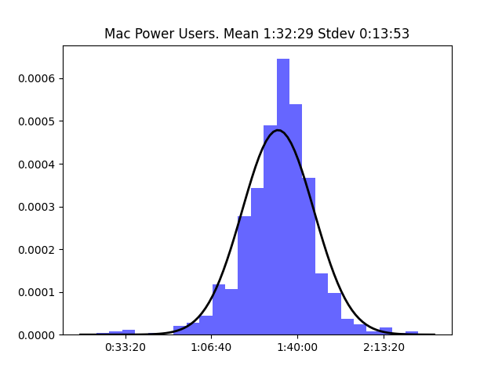

## Make Do

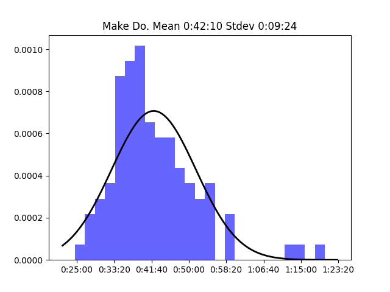

## Material

## Mixed Feelings

## Originality

## Parallel

## Pictorial

## Playing for Fun

## Presentable

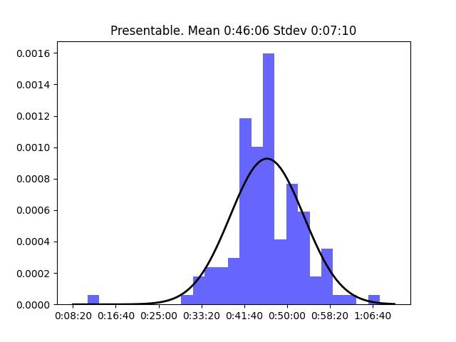

## Query

## Reconcilable Differences

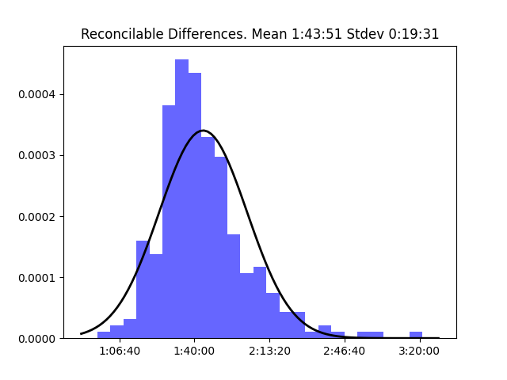

## Remaster

## Roboism

## Rocket

## Subnet

## The Backmarkers

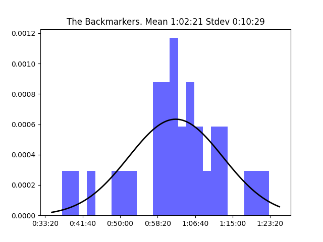

## The Pen Addict

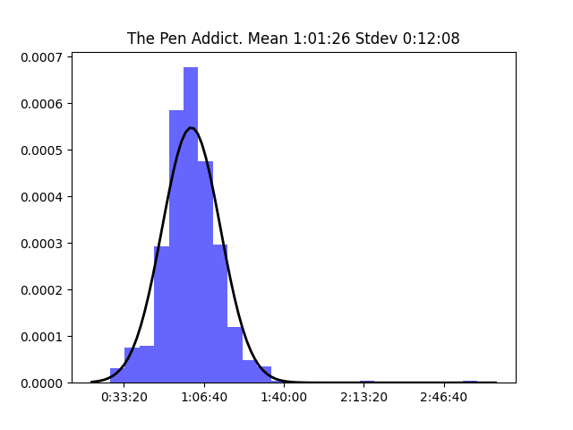

## The Prompt

## The Test Drivers

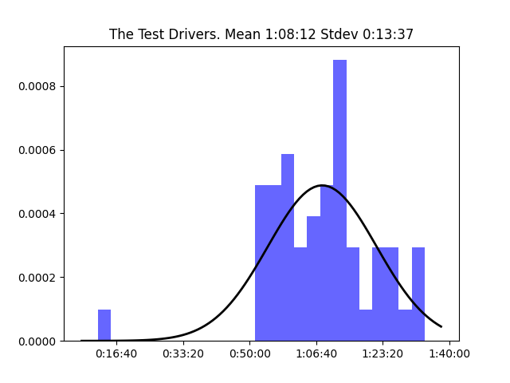

## Thoroughly Considered

## Top Four

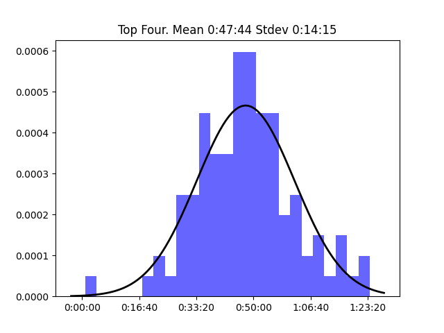

## Under the Radar

## Ungeniused

## Upgrade

## Virtual

