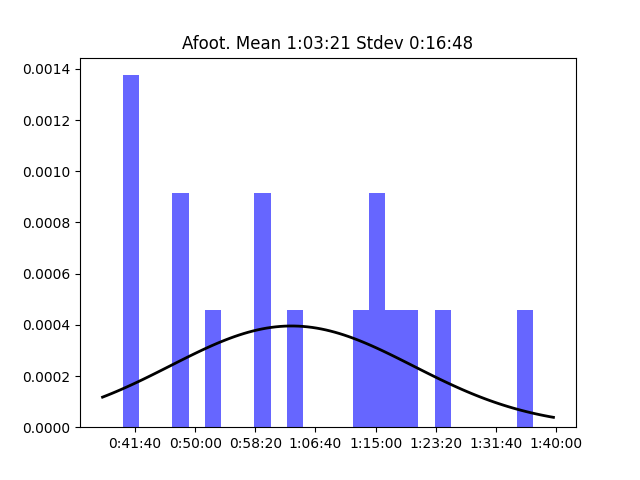
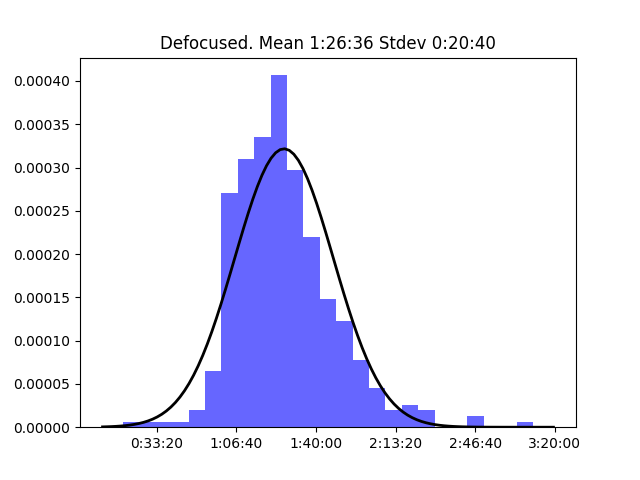
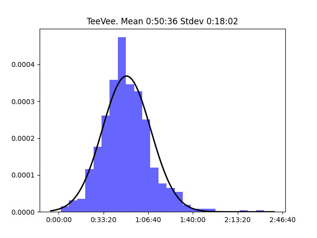

# Incomparable

## Table of Contents:
- [A Complicated Profession: "Star Wars" on TV](#A-Complicated-Profession-Star-Wars-on-TV)  
- [A Legitimate Salvage (The Expanse)](#A-Legitimate-Salvage-The-Expanse)  
- [Afoot](#Afoot)  
- [Agents of SMOOCH](#Agents-of-SMOOCH)  
- [Batman University](#Batman-University)  
- [Bear Left (Right Frog) - A Muppet Movie Podcast](#Bear-Left-Right-Frog--A-Muppet-Movie-Podcast)  
- [Beginner's Puck - A podcast for hockey fans new and old](#Beginners-Puck--A-podcast-for-hockey-fans-new-and-old)  
- [Biff! Superhero TV and movies](#Biff-Superhero-TV-and-movies)  
- [Bonus Track](#Bonus-Track)  
- [Cartoon Cast](#Cartoon-Cast)  
- [Chick Flick Fix](#Chick-Flick-Fix)  
- [Corner of the Sky](#Corner-of-the-Sky)  
- [Defocused](#Defocused)  
- [Doctor Who Flashcast](#Doctor-Who-Flashcast)  
- [Dragonmount: The Wheel of Time Podcast](#Dragonmount-The-Wheel-of-Time-Podcast)  
- [Earp Chirp: Alberta's Wynonna Earp podcast](#Earp-Chirp-Albertas-Wynonna-Earp-podcast)  
- [Football is Life! - Watching "Ted Lasso"](#Football-is-Life--Watching-Ted-Lasso)  
- [Friends in Your Ears](#Friends-in-Your-Ears)  
- [Greetings from the Uncanny Valley](#Greetings-from-the-Uncanny-Valley)  
- [I Want My M(CU)TV: Talking Marvel's New TV Shows](#I-Want-My-MCUTV-Talking-Marvels-New-TV-Shows)  
- [Klickitcast - A Beverly Cleary Podcast](#Klickitcast--A-Beverly-Cleary-Podcast)  
- [Lazy Doctor Who](#Lazy-Doctor-Who)  
- [Lions, Towers & Shields](#Lions-Towers--Shields)  
- [Magnum, podcast - revisiting "Magnum P.I."](#Magnum-podcast--revisiting-Magnum-PI)  
- [Monty and Rhias vs. Movies](#Monty-and-Rhias-vs-Movies)  
- [Myke at the Movies](#Myke-at-the-Movies)  
- [NASA Vending Machine (watching "For All Mankind")](#NASA-Vending-Machine-watching-For-All-Mankind)  
- [Not Playing with Lex and Dan](#Not-Playing-with-Lex-and-Dan)  
- [Pants in the Boot](#Pants-in-the-Boot)  
- [Phil and Lisa Ruin the Movies](#Phil-and-Lisa-Ruin-the-Movies)  
- [Pod4Ham - Every song from the musical Hamilton](#PodHam--Every-song-from-the-musical-Hamilton)  
- [Random Trek](#Random-Trek)  
- [Recently Played](#Recently-Played)  
- [Recently Read - book reviews from The Incomparable](#Recently-Read--book-reviews-from-The-Incomparable)  
- [Robot or Not?](#Robot-or-Not)  
- [Saga of Rereading Epics](#Saga-of-Rereading-Epics)  
- [SestraCast (Orphan Black)](#SestraCast-Orphan-Black)  
- [Somehow I Manage (Rewatching "The Office")](#Somehow-I-Manage-Rewatching-The-Office)  
- [Sophomore Lit](#Sophomore-Lit)  
- [Sorkin' In It: The Films of Aaron Sorkin](#Sorkin-In-It-The-Films-of-Aaron-Sorkin)  
- [TeeVee](#TeeVee)  
- [The Cast of Us: HBO's "The Last Of Us" Recapped](#The-Cast-of-Us-HBOs-The-Last-Of-Us-Recapped)  
- [The Incomparable Game Show](#The-Incomparable-Game-Show)  
- [The Incomparable Mothership](#The-Incomparable-Mothership)  
- [The Incomparable Radio Theater](#The-Incomparable-Radio-Theater)  
- [The Ring Post - an occasional wrestling podcast](#The-Ring-Post--an-occasional-wrestling-podcast)  
- [The Three Hoarsemen](#The-Three-Hoarsemen)  
- [The Villain Edit](#The-Villain-Edit)  
- [This Week in Time Travel](#This-Week-in-Time-Travel)  
- [Tim Goodman's TV Talk Machine](#Tim-Goodmans-TV-Talk-Machine)  
- [Total Party Kill](#Total-Party-Kill)  
- [Unjustly Maligned](#Unjustly-Maligned)  
- [Voyager Revisited](#Voyager-Revisited)  
- [Vulcan Hello (Star Trek Discovery, Picard, Strange New Worlds)](#Vulcan-Hello-Star-Trek-Discovery-Picard-Strange-New-Worlds)  
- [Watchers of the Plus](#Watchers-of-the-Plus)  
- [Where or When](#Where-or-When)  

**Network's longest episode:** Sophomore Lit - Episode 93 Mrs. Dalloway (4:32:08)

**Network's shortest episode:** Lions, Towers & Shields - Episode 61 Big Theremin Energy and an Implied Train (0:00:37)

### A Complicated Profession: "Star Wars" on TV

**Longest episode:** Episode 64 The Mandalorian S3E8: "Chapter 24: The Return" (1:10:26)  
**Shortest episode:** Episode 0 Coming Soon: The Bad Batch (0:01:48)  

### A Legitimate Salvage (The Expanse)

**Longest episode:** Episode 5 "Critical Mass" and "Leviathan Wakes" (1:09:43)  
**Shortest episode:** Episode 0 Coming Soon: A Legitimate Salvage (0:01:10)  

### Afoot

**Longest episode:** Episode 7 When a Man's Partner Is Killed (Several Times) (1:36:48)  
**Shortest episode:** Episode 1 What Happened to the Other Guy? (0:40:00)  

### Agents of SMOOCH

**Longest episode:** Episode 66 We're Porn Friends Now (2:25:06)  
**Shortest episode:** Episode 77 Agency Memo (0:01:23)  

### Batman University

**Longest episode:** Episode 17 "Mask of the Phantasm" (1:34:17)  
**Shortest episode:** Episode 2 "Showdown" with Jeremy Goldstein (0:25:00)  

### Bear Left (Right Frog) - A Muppet Movie Podcast

**Longest episode:** Episode 3 The Muppets Take Manhattan (1:30:17)  
**Shortest episode:** Episode 10 Muppets Haunted Mansion (0:38:04)  

### Beginner's Puck - A podcast for hockey fans new and old

**Longest episode:** Episode 35 From Pucks and Sticks to Analytics (1:20:00)  
**Shortest episode:** Episode 36a Short Shift - Erika (0:01:50)  

### Biff! Superhero TV and movies

**Longest episode:** Episode 16 Superman: The Movie (1:58:00)  
**Shortest episode:** Episode 174 No Bloody Ant-Man, Batman, Constantine, *or* Deadpool (0:10:53)  

### Bonus Track

**Longest episode:** Episode 247b David Letterman Interviews (3:25:42)  
**Shortest episode:** Episode 347b Insert Star Wars Teaser Reaction Here (0:01:04)  

### Cartoon Cast

**Longest episode:** Episode 4 Booby Trap Bodyguard (1:36:16)  
**Shortest episode:** Episode 1 We Ship Cartoons (0:45:38)  

### Chick Flick Fix

**Longest episode:** Episode 46 Three Men And A Baby (1:18:47)  
**Shortest episode:** Episode 58 Spice World (0:37:01)  

### Corner of the Sky

**Longest episode:** Episode 25 Moist and Worried (1:34:40)  
**Shortest episode:** Episode 0 Welcome to Corner of the Sky (0:02:21)  

### Defocused

**Longest episode:** Episode 88 Old People Problems (3:10:52)  
**Shortest episode:** Episode 78 Defocused: 2015  Year in Review (0:19:11)  

### Doctor Who Flashcast

**Longest episode:** Season 7 Second Half Review (The Incomparable 142) (1:38:02)  
**Shortest episode:** “Curse of the Black Spot.” (S6E3) (The Incomparable 38) (0:24:50)  

### Dragonmount: The Wheel of Time Podcast

**Longest episode:** Episode 8 "The Dark Along the Ways" (S1E7) (1:45:39)  
**Shortest episode:** Episode 5 "The Dragon Reborn" (S1E4) (0:01:26)  

### Earp Chirp: Alberta's Wynonna Earp podcast

**Longest episode:** Episode 40 A Very Earpmas Commentary (0:56:23)  
**Shortest episode:** Episode 46 Teaser! Chirpers Live Again (0:04:23)  

### Football is Life! - Watching "Ted Lasso"

**Longest episode:** Episode 3 "Trent Crimm: The Independent" Rewatch (S1E3) (1:37:58)  
**Shortest episode:** Episode 30 "The Strings that Bind Us" (S3E7) (0:44:00)  

### Friends in Your Ears

**Longest episode:** Episode 28 Mark Bramhill and Suzy Buttress (1:58:45)  
**Shortest episode:** Episode 88 Cicero Holmes and Julianna Coughlin (0:05:56)  

### Greetings from the Uncanny Valley

**Longest episode:** Analysis: "Les Écorchés " (S2E7) (TeeVee 443) (1:36:05)  
**Shortest episode:** Episode 58 The Complete Opposite of Matlock (0:11:39)  

### I Want My M(CU)TV: Talking Marvel's New TV Shows

**Longest episode:** WandaVision S1E9 Review: "The Series Finale" (TeeVee 697) (1:50:07)  
**Shortest episode:** Episode 36 "Moon Knight" Episode 2 (0:37:57)  

### Klickitcast - A Beverly Cleary Podcast

**Longest episode:** Episode 1 Henry Huggins (1:30:01)  
**Shortest episode:** Episode 33 Epilogue (0:22:43)  

### Lazy Doctor Who

**Longest episode:** Episode 215 CarCast! (0:58:58)  
**Shortest episode:** Episode 31 The Romans 2-3 (0:07:05)  

### Lions, Towers & Shields

**Longest episode:** Episode 60 Celebrate the Teresa Wright-aissance (1:43:39)  
**Shortest episode:** Episode 61 Big Theremin Energy and an Implied Train (0:00:37)  

### Magnum, podcast - revisiting "Magnum P.I."

**Longest episode:** Episode 41 "Ki'i's Don't Lie" (S3E3) & "Emeralds Are Not a Girl's Best Friend" (S&S S2E1) (1:21:18)  
**Shortest episode:** Episode 8 "The Elmo Ziller Story" (S2E21) (0:17:20)  

### Monty and Rhias vs. Movies

**Longest episode:** Episode 8 Atolladero (0:37:45)  
**Shortest episode:** Episode 25 M3GAN (0:12:06)  

### Myke at the Movies

**Longest episode:** Episode 11 "Christmas Vacation" (1:25:09)  
**Shortest episode:** Episode 35 Firefly: "The Message" (0:11:36)  

### NASA Vending Machine (watching "For All Mankind")

**Longest episode:** "The Gray" (S2E10) (1:02:06)  
**Shortest episode:** Episode 16 "New Eden" (S3E6) (0:28:24)  

### Not Playing with Lex and Dan

**Longest episode:** Episode 8 Star Wars: The Force Awakens (0:58:13)  
**Shortest episode:** Episode 5 Witness (0:17:40)  

### Pants in the Boot

**Longest episode:** Episode 35 The Detector Van Is a Lie (0:32:48)  
**Shortest episode:** Episode 5 Boot v Trunk (0:02:56)  

### Phil and Lisa Ruin the Movies

**Longest episode:** Episode 32 Phil And Lisa Ruin Star Wars (1:04:52)  
**Shortest episode:** Episode 1 Purge Insurance (0:20:39)  

### Pod4Ham - Every song from the musical Hamilton

**Longest episode:** Episode 46b Disney+ Descriptive Audio (2:35:47)  
**Shortest episode:** Episode 12 You Are the Worst, Burr (0:11:17)  

### Random Trek

**Longest episode:** Episode 81 "Star Trek IV: The Voyage Home" with David J. Loehr, Tony Sindelar, and Jason Snell (1:56:14)  
**Shortest episode:** Episode 221 "Tattoo" (VOY) with Marisa McClellan (0:30:53)  

### Recently Played

**Longest episode:** Episode 1 Sayonara Wild Hearts (1:17:55)  
**Shortest episode:** Episode 3 Nintendo Wishcasting (0:25:22)  

### Recently Read - book reviews from The Incomparable

**Longest episode:** Episode 47 "Famous Men Who Never Lived" by K. Chess (0:09:44)  
**Shortest episode:** Episode 50 "Interior Chinatown" by Charles Yu (0:01:59)  

### Robot or Not?

**Longest episode:** Episode 105 Canonical Bagel Flavors (0:18:28)  
**Shortest episode:** Episode 5 Emotions (0:00:48)  

### Saga of Rereading Epics

**Longest episode:** Episode 10 Magnificat (1:32:33)  
**Shortest episode:** Episode 1 Why Read These Books? (0:40:38)  

### SestraCast (Orphan Black)

**Longest episode:** Episode 40 "From Dancing Mice to Psychopaths" (S4E10) (1:23:13)  
**Shortest episode:** Episode 11 "Nature Under Constraint and Vexed" (S2E1) (0:42:03)  

### Somehow I Manage (Rewatching "The Office")

**Longest episode:** Episode 190 Güten Pränk (S9E24/25) (1:36:14)  
**Shortest episode:** Episode 39 We're Going to Sandals Jamaica (Holiday Break) (0:03:08)  

### Sophomore Lit

**Longest episode:** Episode 93 Mrs. Dalloway (4:32:08)  
**Shortest episode:** Episode 109 Yes, Virginia, There is a Santa Claus (0:15:53)  

### Sorkin' In It: The Films of Aaron Sorkin

**Longest episode:** Episode 5 The Social Network (0:49:19)  
**Shortest episode:** Episode 0 Sorkin' in It: Trailer (0:06:25)  

### TeeVee

**Longest episode:** Episode 382 The Punisher War Journal: Episodes 10-13 (2:32:58)  
**Shortest episode:** Episode PSA 'Vulcan Hello' and 'Biff' aren't here! (0:01:48)  

### The Cast of Us: HBO's "The Last Of Us" Recapped

**Longest episode:** Episode 10 S1E9 Review: "Look for the Light" (2:00:42)  
**Shortest episode:** Episode 1 Trailer Analysis (0:46:26)  

### The Incomparable Game Show

**Longest episode:** Episode 3 Tennis with Errol Flynn (2:23:21)  
**Shortest episode:** Episode 8 Je Suis La Poire (0:30:24)  

### The Incomparable Mothership

**Longest episode:** Episode 138 All Hail the Lion! (3:28:43)  
**Shortest episode:** Episode 38 Curse of the Bad Plot (0:24:50)  

### The Incomparable Radio Theater

**Longest episode:** Episode 11 The Adventures of Timmy Preston in Farfutureland (0:50:30)  
**Shortest episode:** Episode 0 Season 2 Teaser (0:02:13)  

### The Ring Post - an occasional wrestling podcast

**Longest episode:** Episode 19 There's a Lot of Wrestling (1:53:00)  
**Shortest episode:** Episode 0 Introduction (0:02:42)  

### The Three Hoarsemen

**Longest episode:** Episode 29 2015 Favorites (2:01:19)  
**Shortest episode:** Episode 51 The Dawn of Man (0:02:08)  

### The Villain Edit

**Longest episode:** Episode 21 The Monkey-Haired Christmas Tree Yeti (1:14:20)  
**Shortest episode:** Episode 57 Gingerbread and Drag Queens (0:21:45)  

### This Week in Time Travel

**Longest episode:** Episode 17 Red White (and Orange and Yellow and Blue) and Who (1:35:06)  
**Shortest episode:** Episode 0 Coming Soon... (0:01:05)  

### Tim Goodman's TV Talk Machine

**Longest episode:** Episode 32 Green Brains & Ham (1:22:56)  
**Shortest episode:** Episode 27 Werewolf Don Draper (0:24:56)  

### Total Party Kill

**Longest episode:** Episode 363 Dragonforge Goes Shopping (3:35:17)  
**Shortest episode:** Episode 65 In That Trunk Is Some Funk (0:35:52)  

### Unjustly Maligned

**Longest episode:** Episode 77 Eurovision Song Contest 2017 pre-show glitterball special! (1:57:51)  
**Shortest episode:** Episode 5 "Last Action Hero" with Alison Baker (0:37:14)  

### Voyager Revisited

**Longest episode:** Episode 32 We'll Always Have Unimatrix Zero (The Two-Parters) (1:03:29)  
**Shortest episode:** Episode 0 Voyager Revisited Launches (0:01:57)  

### Vulcan Hello (Star Trek Discovery, Picard, Strange New Worlds)

**Longest episode:** Episode 30 "Star Trek: Discovery" season 3 wrap-up (1:29:26)  
**Shortest episode:** Star Trek: Discovery Short Treks #4 Review: "The Escape Artist" (TeeVee 516) (0:19:46)  

### Watchers of the Plus

**Longest episode:** Episode 6 Invincible Is Now All Elite! (1:36:32)  
**Shortest episode:** Episode 14 Thanos Loves a Good Argument (0:38:03)  

### Where or When

**Longest episode:** Episode 02 The Charge of the Abraham Lincoln Brigade (0:32:00)  
**Shortest episode:** Episode 03 The Sun is the Same in a Relative Way (0:23:28)  

