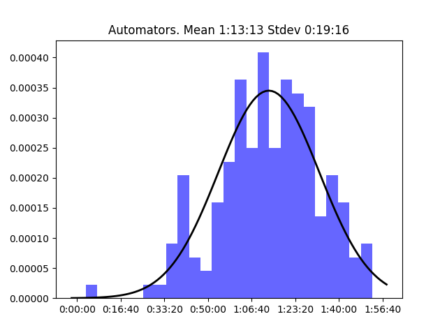
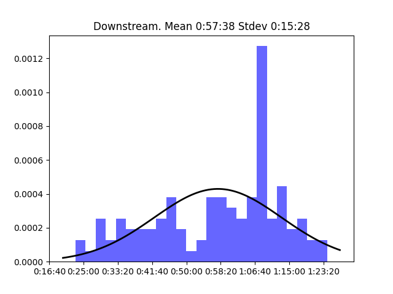
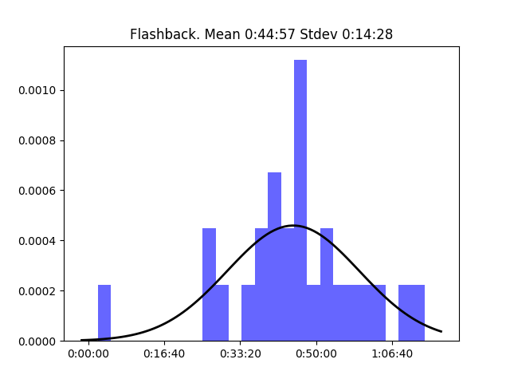
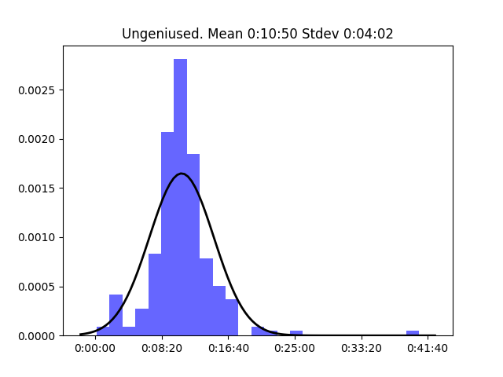

# Relay FM

## Table of Contents:
- [20 Macs for 2020](#-Macs-for-)  
- [Adapt](#Adapt)  
- [Analog(ue)](#Analogue)  
- [Automators](#Automators)  
- [BONANZA](#BONANZA)  
- [Bionic](#Bionic)  
- [CMD Space](#CMD-Space)  
- [Canvas](#Canvas)  
- [Clockwise](#Clockwise)  
- [Conduit](#Conduit)  
- [Connected](#Connected)  
- [Cortex](#Cortex)  
- [Disruption](#Disruption)  
- [Download](#Download)  
- [Downstream](#Downstream)  
- [Flashback](#Flashback)  
- [Focused](#Focused)  
- [Inquisitive](#Inquisitive)  
- [Isometric](#Isometric)  
- [Less Than or Equal](#Less-Than-or-Equal)  
- [Liftoff](#Liftoff)  
- [Mac Power Users](#Mac-Power-Users)  
- [Make Do](#Make-Do)  
- [Material](#Material)  
- [Mixed Feelings](#Mixed-Feelings)  
- [Originality](#Originality)  
- [Paper Places](#Paper-Places)  
- [Parallel](#Parallel)  
- [Pictorial](#Pictorial)  
- [Playing for Fun](#Playing-for-Fun)  
- [Presentable](#Presentable)  
- [Query](#Query)  
- [Reconcilable Differences](#Reconcilable-Differences)  
- [Remaster](#Remaster)  
- [Roboism](#Roboism)  
- [Rocket](#Rocket)  
- [The Backmarkers](#The-Backmarkers)  
- [The Pen Addict](#The-Pen-Addict)  
- [The Prompt](#The-Prompt)  
- [The Test Drivers](#The-Test-Drivers)  
- [Thoroughly Considered](#Thoroughly-Considered)  
- [Top Four](#Top-Four)  
- [Under the Radar](#Under-the-Radar)  
- [Ungeniused](#Ungeniused)  
- [Upgrade](#Upgrade)  
- [Virtual](#Virtual)  

**Network's longest episode:** Cortex - Episode 135 State of the Apps 2023 (3:22:00)

**Network's shortest episode:** Ungeniused - Episode 173 Seven Swans A-swimming (0:00:12)

### 20 Macs for 2020

**Longest episode:** Episode 21 John Siracusa, part 1 (1:44:09)  
**Shortest episode:** Episode 0 Introduction (0:02:10)  

### Adapt

**Longest episode:** Episode 29 App Extravaganza (1:26:28)  
**Shortest episode:** Episode 28 iPadOS 14 (0:47:00)  

### Analog(ue)

**Longest episode:** Episode 211 Ha La BUSINESS (1:50:55)  
**Shortest episode:** Episode 24 I Don't Want To Burden People (0:39:48)  

### Automators

**Longest episode:** Episode 74 Stream Deck: Going Large (1:52:42)  
**Shortest episode:** Episode 0 Introduction (0:03:24)  

### BONANZA

**Longest episode:** Episode 5 Myke Hurley and the CES Band (1:20:43)  
**Shortest episode:** Episode 36 2 Horst 2 Horsiest (0:40:54)  

### Bionic

**Longest episode:** Episode 56 Different Shades Of Beige (1:33:04)  
**Shortest episode:** Episode 88 BONANZA! (Part One) (0:38:56)  

### CMD Space

**Longest episode:** Episode 1 I'm Yelling At Me, With Merlin Mann (1:41:27)  
**Shortest episode:** Episode 74 Awesome On The Internet, with Veronica Belmont (0:30:24)  

### Canvas

**Longest episode:** Episode 36 Wishes for iOS 11 (1:16:30)  
**Shortest episode:** Episode 39 Everyone Can Code on iPad (0:28:06)  

### Clockwise

**Longest episode:** Episode 68 Genuine Frontier Gibberish (0:46:21)  
**Shortest episode:** Episode 346 Beyoncé in Space! (0:22:51)  

### Conduit

**Longest episode:** Episode 37 Systems Check Fall 2022 - Systems Don’t Solve Everything (1:36:48)  
**Shortest episode:** Episode 0 Episode 0 - It’s the Show! (0:10:21)  

### Connected

**Longest episode:** Episode 24 A Whole Website in the Palm of Your Hand (2:56:24)  
**Shortest episode:** Episode 478 Not So Bankrupt Anymore (0:46:09)  

### Cortex

**Longest episode:** Episode 135 State of the Apps 2023 (3:22:00)  
**Shortest episode:** Episode 30 Cortexaversary (1:07:24)  

### Disruption

**Longest episode:** Episode 28 Breakdancing Surgeons (1:27:12)  
**Shortest episode:** Episode 6 Mirror Mikah (0:43:15)  

### Download

**Longest episode:** Episode 78 Great for Robots; Bad for People (1:15:06)  
**Shortest episode:** Episode 108 Keep Watching the Headlines (0:35:17)  

### Downstream

**Longest episode:** Episode 14 Quintessential Identity Crisis (1:23:03)  
**Shortest episode:** Episode 46 The Chris Licht Conundrum (0:23:09)  

### Flashback

**Longest episode:** Episode 4 webOS (1:13:47)  
**Shortest episode:** Episode 0 Introduction (0:02:10)  

### Focused

**Longest episode:** Episode 85 The Depth of Our Madness (1:43:04)  
**Shortest episode:** Episode 11 Balancing Dollars and Delight (0:23:53)  

### Inquisitive

**Longest episode:** Episode 1 Having Principles, with Marco Arment (1:32:58)  
**Shortest episode:** Episode 33 Behind the App #7: Identity (0:26:23)  

### Isometric

**Longest episode:** Episode 26 (Special) Glenn and I Are Not Enemies (2:21:43)  
**Shortest episode:** Episode 102 Disruption Is Here! (0:01:10)  

### Less Than or Equal

**Longest episode:** Episode 12 Steve Lubitz (1:41:12)  
**Shortest episode:** Episode 7 Twelve Black Tech & Science Pioneers (0:06:50)  

### Liftoff

**Longest episode:** Episode 66 Fancy Ballast (1:20:25)  
**Shortest episode:** Episode 94 A Planned Countdown Hold (0:21:58)  

### Mac Power Users

**Longest episode:** Episode 100 Awesome MPU Listeners (2:26:39)  
**Shortest episode:** Episode 2 All About E-Mail (Part 2) (0:22:15)  

### Make Do

**Longest episode:** Episode 4 From The Pen Show – Double Broad, Double Feature! (1:20:19)  
**Shortest episode:** Episode 30 I Know You Are But What Am I? (0:24:37)  

### Material

**Longest episode:** Episode 411 The AI Message (1:55:21)  
**Shortest episode:** Episode 26 Mint Condition (0:30:32)  

### Mixed Feelings

**Longest episode:** Episode 34 Libertarian Land (1:00:42)  
**Shortest episode:** Episode 26 Hope It's Not Dominos (0:35:53)  

### Originality

**Longest episode:** Episode 16 Someone Needs Me to Talk About Jem & the Holograms (1:36:42)  
**Shortest episode:** Episode 24 Bury Your Shoulds (0:44:55)  

### Paper Places

**Longest episode:** Episode 3 Writing Residencies and Getting a Six-Figure Book Deal, with Ellen Atlanta (1:15:22)  
**Shortest episode:** Episode 0 An Introductory Q&A (0:13:57)  

### Parallel

**Longest episode:** Episode 41 A Tech Year in Review (1:28:59)  
**Shortest episode:** Episode 0 Introducing Parallel (0:06:48)  

### Pictorial

**Longest episode:** Episode 34 No But Really, What Are NFTs? (0:52:53)  
**Shortest episode:** Episode 41 Theosophy & Abstract Art (0:22:21)  

### Playing for Fun

**Longest episode:** Episode 7 The Legend of Zelda: Breath of the Wild (1:29:08)  
**Shortest episode:** Episode 3 Threes and Flipflop Solitaire (0:32:37)  

### Presentable

**Longest episode:** Episode 38 Design vs Capitalism (1:08:03)  
**Shortest episode:** Episode 123 Finale (0:11:12)  

### Query

**Longest episode:** Episode 46 A Party in Your Optical Drive (0:56:03)  
**Shortest episode:** Episode 8 Firmware is Fertilizer (0:19:02)  

### Reconcilable Differences

**Longest episode:** Episode 25 Zarro Droogs (3:21:09)  
**Shortest episode:** Episode 233 Monkeys in the Hose (0:56:56)  

### Remaster

**Longest episode:** Episode 26 The Nintendo Switch Presentation (1:30:48)  
**Shortest episode:** Episode 7 Interviews from GDC (0:33:14)  

### Roboism

**Longest episode:** Episode 36 You Have a Patina (1:23:50)  
**Shortest episode:** Episode 13 Information Pores (0:21:04)  

### Rocket

**Longest episode:** Episode 470 Terminated (2:00:21)  
**Shortest episode:** Episode 315 Trump’s Twitter Ban (0:21:25)  

### The Backmarkers

**Longest episode:** Episode 29 2024 Season Preview (1:23:05)  
**Shortest episode:** Episode 8 Canadian Grand Prix Review (0:37:06)  

### The Pen Addict

**Longest episode:** Episode 500 Pens! (3:00:29)  
**Shortest episode:** Episode 33 Field Notes Fascination (0:27:39)  

### The Prompt

**Longest episode:** Episode 30 The Internet in Your Pocket (2:35:19)  
**Shortest episode:** Episode 16 The Mind of the Underscore (0:52:19)  

### The Test Drivers

**Longest episode:** Episode 19 Goodbye Z Flip..? (1:33:52)  
**Shortest episode:** Episode 0 Welcome to The Test Drivers (0:12:04)  

### Thoroughly Considered

**Longest episode:** Episode 109 The Last Detail with CW&T (1:19:58)  
**Shortest episode:** Episode 1 Introductions (0:20:55)  

### Top Four

**Longest episode:** Episode 34 Stardew Valley Singles (1:23:57)  
**Shortest episode:** Episode 20 Jelly Belly Teaser (0:00:58)  

### Under the Radar

**Longest episode:** Episode 244 WWDC 2022 Special (0:44:34)  
**Shortest episode:** Episode 5 Managing Feedback (0:25:30)  

### Ungeniused

**Longest episode:** Episode 1 Action Park (0:40:34)  
**Shortest episode:** Episode 173 Seven Swans A-swimming (0:00:12)  

### Upgrade

**Longest episode:** Episode 332 The 2020 Upgradies (2:34:11)  
**Shortest episode:** Episode 483 The 2023 October Event Draft (0:27:42)  

### Virtual

**Longest episode:** Episode 9 The Video Game Room (1:30:45)  
**Shortest episode:** Episode 61 We Have a New Show (0:01:36)  

